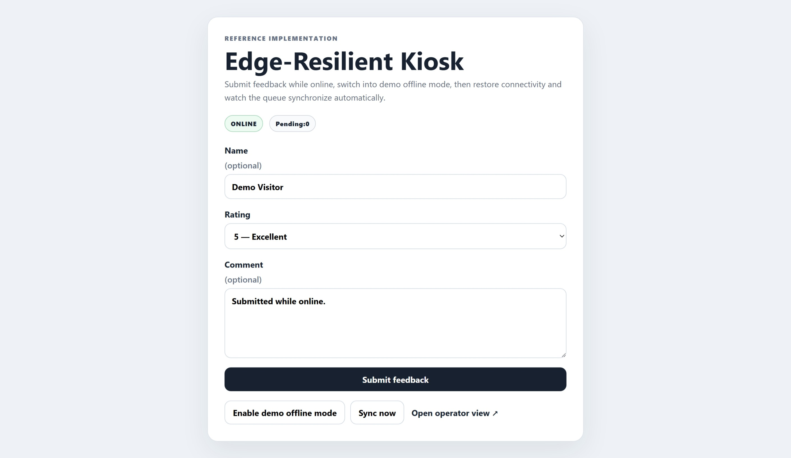
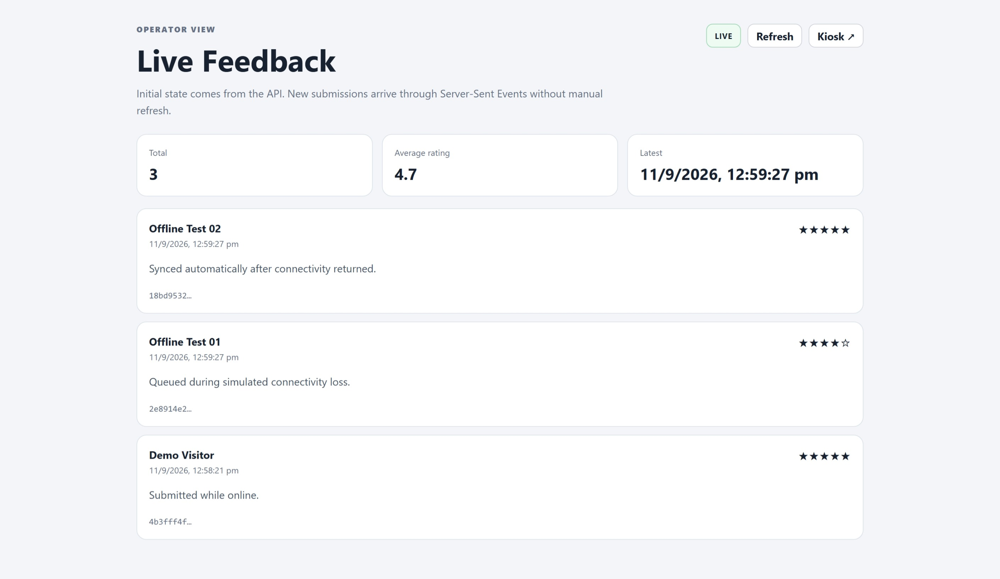

# Edge-Resilient Kiosk Demo

A small runnable reference implementation of an offline-resilient visitor kiosk pattern: local queueing in the browser, retry synchronization, idempotent writes, local SQLite persistence, and real-time operator updates.

> This is a clean public demonstration built to explain an engineering pattern. It is **not** production museum code and contains no client data, credentials, internal infrastructure, or proprietary implementation details.

## What it demonstrates

```text
Kiosk Browser
    │
    ├── online ───────────────→ Flask API ─────→ SQLite
    │                              │
    │                              └────────────→ Operator Event Stream
    │
    └── unavailable/offline
             ↓
        localStorage queue
             ↓
        automatic retry
             ↓
          Flask API
```
## Interface Preview

The demo includes a visitor-facing kiosk and a live operator view.

### 1. Kiosk — normal online operation

The kiosk accepts submissions directly when the local service is available.



### 2. Kiosk — offline queue behaviour

When the service becomes unavailable, submissions are stored locally and queued for retry.


### 3. Operator view — synchronized live feed

The operator interface receives new submissions in real time once they are accepted by the backend.



...

The important behaviours are:

- A visitor can submit while the service is unavailable.
- The submission is stored in browser `localStorage` instead of being discarded.
- The browser retries queued items when connectivity returns.
- Every submission carries a client-generated UUID, allowing the backend to handle retries idempotently.
- The backend persists accepted submissions in SQLite.
- The operator screen receives new submissions through Server-Sent Events (SSE) without manual refresh.
- The demo includes a built-in offline-mode switch so the failure path can be tested without disconnecting the computer.

## Stack

- Python
- Flask
- SQLite
- Vanilla JavaScript
- Browser `localStorage`
- Server-Sent Events

The intentionally small stack keeps the resilience pattern visible instead of hiding it behind framework complexity.

## Repository structure

```text
edge-resilient-kiosk-demo/
├── README.md
├── .gitignore
├── backend/
│   ├── app.py
│   └── requirements.txt
├── kiosk/
│   ├── index.html
│   ├── app.js
│   └── styles.css
└── operator/
    ├── index.html
    ├── app.js
    └── styles.css
```

## Run locally

### Windows CMD

```bat
python -m venv .venv
.venv\Scripts\activate
pip install -r backend\requirements.txt
python backend\app.py
```

Then open:

```text
Kiosk:    http://127.0.0.1:5000/
Operator: http://127.0.0.1:5000/operator/
```

### macOS / Linux

```bash
python3 -m venv .venv
source .venv/bin/activate
pip install -r backend/requirements.txt
python backend/app.py
```

## Demo the offline queue

1. Open the kiosk and operator views in separate browser tabs.
2. Submit one feedback entry while online. It should appear immediately in the operator view.
3. On the kiosk, click **Enable demo offline mode**.
4. Submit two or three more entries. The kiosk will show them as pending.
5. Click **Restore demo connectivity**.
6. The queued submissions will synchronize automatically and appear in the operator view.

The retry loop also runs periodically, so manual synchronization is not required once connectivity is available.

## Why client-generated IDs matter

Network failures create ambiguity. A request may reach the server successfully even when the client never receives the response.

Blindly retrying can therefore create duplicate records.

This demo generates a UUID before the first submission attempt:

```text
Create client_id
      ↓
Attempt submission
      ↓
No confirmed response
      ↓
Queue locally
      ↓
Retry same client_id
      ↓
Backend UNIQUE constraint
      ↓
One logical submission
```

This is a small example of designing for failure rather than assuming every request has a clean success/failure outcome.

## Real-time operator updates

The operator page first loads recent records through a normal REST endpoint:

```text
GET /api/feedback
```

It then opens an SSE stream:

```text
GET /api/events
```

When a new submission is committed, the backend publishes an event to connected operator screens.

SSE was chosen for this reference implementation because the data flow is primarily server → operator and it works in the browser without an additional client library. A WebSocket implementation would be appropriate where bidirectional real-time control is required.

## API

### Health

```http
GET /api/health
```

### List recent submissions

```http
GET /api/feedback
```

### Create submission

```http
POST /api/feedback
Content-Type: application/json
```

Example body:

```json
{
  "client_id": "7d253cf1-24cc-48a3-b62d-92321930715d",
  "visitor_name": "Demo Visitor",
  "rating": 5,
  "comment": "Worked even after an offline retry."
}
```

### Operator event stream

```http
GET /api/events
```

## Engineering decisions

### Local queue before complex infrastructure

For a kiosk attached to a local edge service, browser storage is sufficient to demonstrate a durable retry boundary. A production system may require stronger persistence depending on data criticality and device-management requirements.

### SQLite for the reference backend

The purpose of the project is not horizontal scaling. SQLite provides deterministic local persistence with almost no operational overhead and makes the demo easy to clone and run.

### Idempotency at the database boundary

The backend enforces uniqueness on `client_id`. Duplicate retries therefore resolve to the existing record instead of producing another visitor submission.

### SSE for one-way live updates

The operator needs notifications from the backend; it does not need a bidirectional socket protocol for this demo. Using the narrowest suitable technology keeps the implementation easier to reason about.

## What this intentionally does not include

This reference implementation does not attempt to demonstrate:

- User authentication
- Multi-tenant authorization
- Encryption key management
- Production process supervision
- Device fleet management
- Cloud synchronization
- Production observability
- Remote administration
- Personally identifiable production data

Those are separate production concerns and would add noise to the resilience pattern this repository is intended to show.

## Relation to my deployment work

This repository demonstrates a generalized pattern relevant to interactive and edge deployments: visitor-facing systems should degrade gracefully when a dependency becomes temporarily unavailable.

The implementation here was written specifically for public demonstration and should not be interpreted as a copy of any client production system.
